# Navigating the Internet Seas 🗺️
## Morgan's Log 📜

### 7 Feb 2025
Seems that I overslept last night...I do not know where I am! The waves of the Internet Seas must have knocked me out and set me off track from the route I was heading. No worries. I shall fear not as I am Captain Morgan, fearless explorer of this digital landscape.

It is truly incredible here. Messages travel at breakneck speeds, unseen but ever-present, like the wind guiding a ship’s sail. I do not yet have a map to guide me, but that shall be my task. I will explore these mysterious lands, chart their paths, and document my findings for future sailors of the digital world. This vast, interconnected Internet sea shall soon be revealed, and I, Captain Morgan, shall be its first great navigator. 

#### Ship Preparation ⚓️
As I venture into uncharted territory, I need take note of my surroundings. This area shall be home base, as I am unfamiliar with nothing else. I shall name this LMU. Let me search my Internet Protocol, Subnet Mask, Router, and Domain Name Server.

- IP Address: 10.27.238.138
- Subnet Mask: 255.255.0.0
- Router: 10.27.0.4
- Domain Name Servers: 10.0.100.16, 10.0.100.17

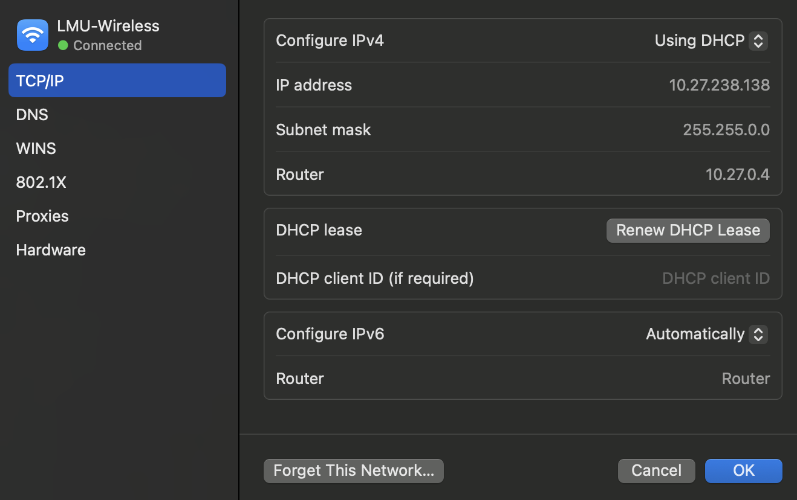

Perfect! Now let me review the routing table to see where I can get to from here.

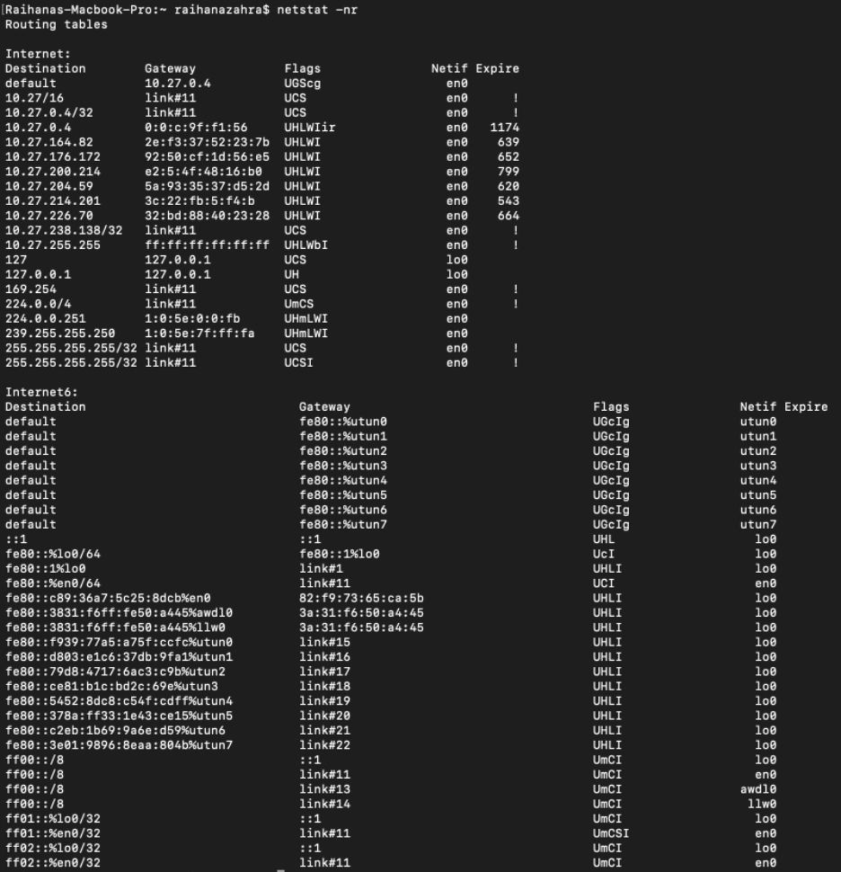

Wow...I sure am lucky to be an explorer. There is so much to this world to see. However, it's getting late. I have a whole day ahead of me tomorrow with full energy, so I suppose I can wait. 

### 8 Feb 2025
What a beautiful day to set sail and venture yonder. With the ship secured, I shall scan the surrounding perimeter to seek other vessels. Fortunately, some are friendly and others... are okay. 

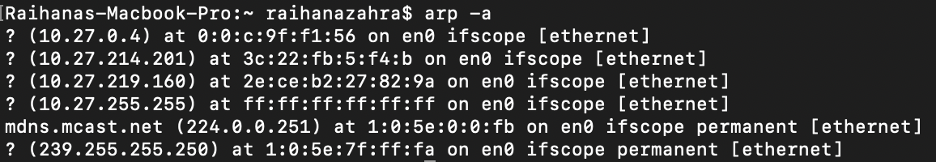

I am curious as to whether any of these ships would answer me call, I sent forth me trusty parrot, Squawkzilla, for contact. One was friendly enough to answer back.

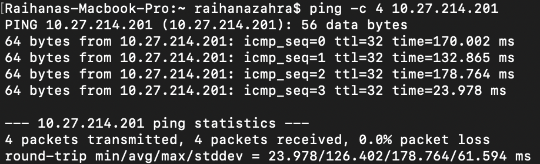

Arghh matey! If Squakzilla was able to contact vessel 10.27.214.201, there is a chance I may find a route to get me to them!

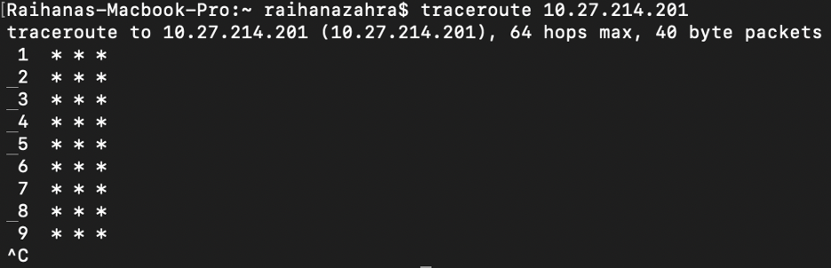

Darn. Seems like the route is too foggy, I cannot make clear of anything. The seas are treacherous, but I will not be deterred! I shall try again to ping and traceroute with the router and DNS instead.

_**Router**_

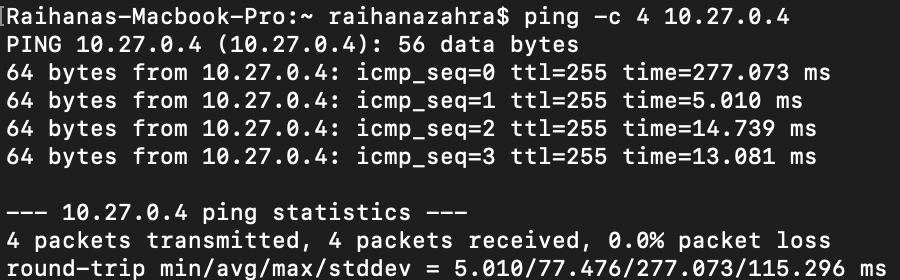
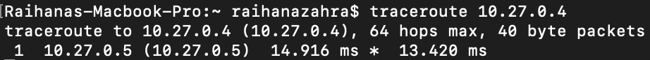

_**Domain Name Servers (DNS)**_

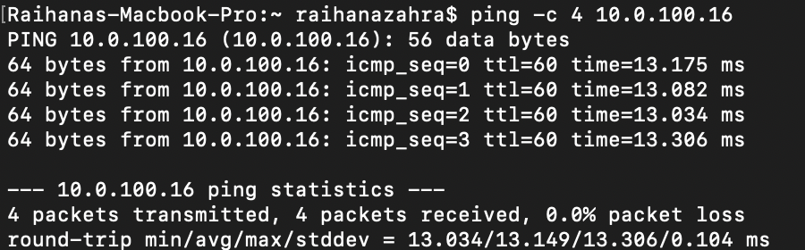
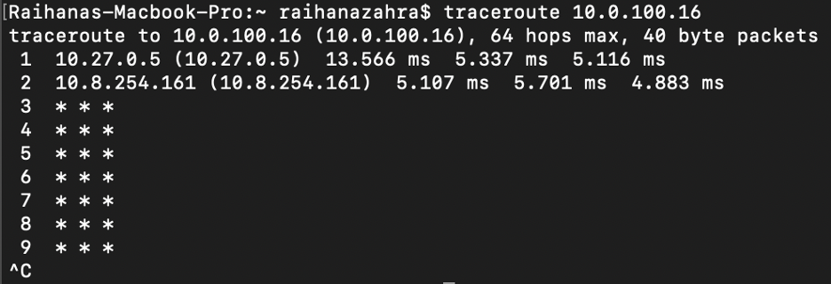

Shiver me timbers! I see results! This means I might be able to get a better sense of where I am at if I can gather enough information of the two areas on the map that I know of. I shall contact LMU home base and snake.io, to see my favorite snakes. I shall do it, yet again.

_**LMU**_

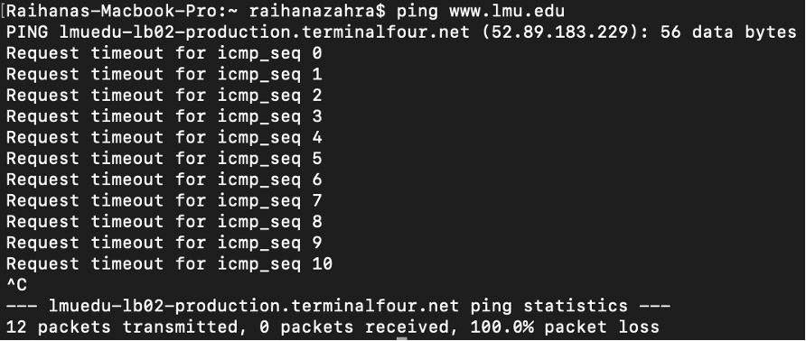
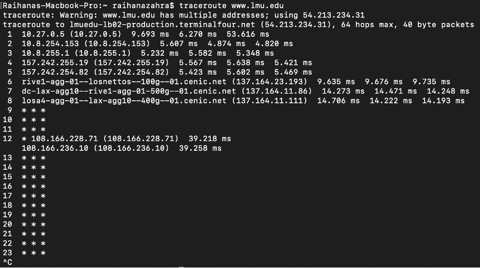

_**Snake.io**_

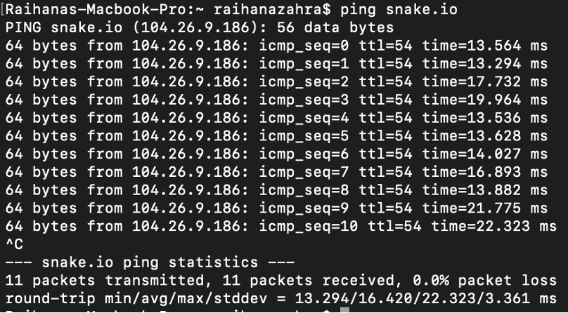
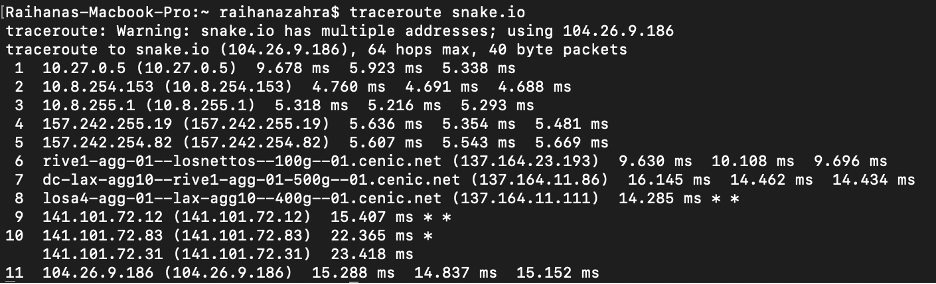

With the waters unclear and the foggy air, I shall use my ancient tool -- my enchanted spyglass called the dig. Perhaps it will reveal the true coordinates of these lands!

_**LMU**_

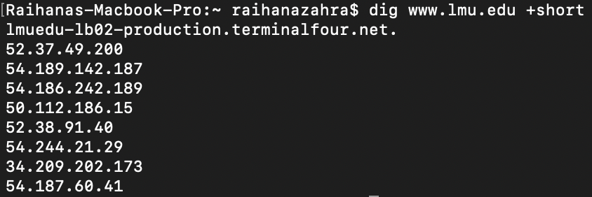

_**Snake.io**_

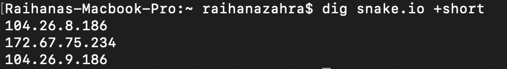

Aha! The charts reveal that LMU hides behind many veils: 52.37.49.200, 54.189.142.187, 54.186.242.189, 50.112.186.15, and more! The fortress may have many gates, but at last, I know where they stand. Though they keep their walls high, knowledge be power! The snake as well, it lurks across 104.26.8.186, 172.67.75.234, and 104.26.9.186. This will be an interesting adventure. 

Let me see where the ports open at both of these sites. I may be able to find civilization after doing so.

_**LMU**_

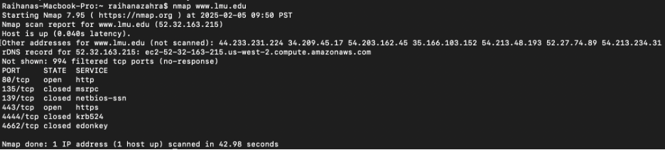

_**Snake.io**_

Hmmm. I notice that both sites go through Port 80/tcp and 443/tcp with LMU having 994 filtered tcp ports and Snake.io having 988 filtered tcp ports. 

With me maps in hand, I realize that the journey to these distant lands is not so straightforward. There be intermediary stops along the way, stepping stones guiding me toward me destination. I shall uncover what ports may be open on these stops! This will lead me to where to go next in my voyage...

_**LMU**_

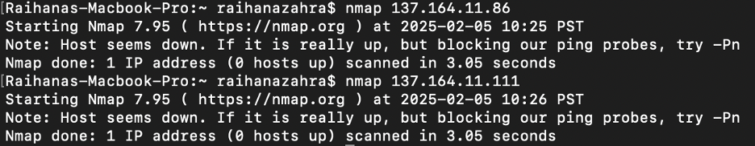

_**Snake.io**_

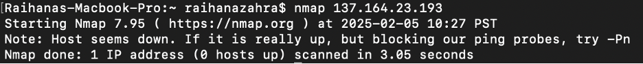

Ahoy! These hidden pathways show me the routes I must take, with some ports standing open for travel, while others remain closed or concealed. The Internet seas be vast, but I be learning its secrets one route at a time! I shall continue on my way. Now onto the Peets network to sip on my favorite coffee beans and perhaps the Concourse to maybe have a good nights sleep. Onwards...

### 10 Feb 2025

