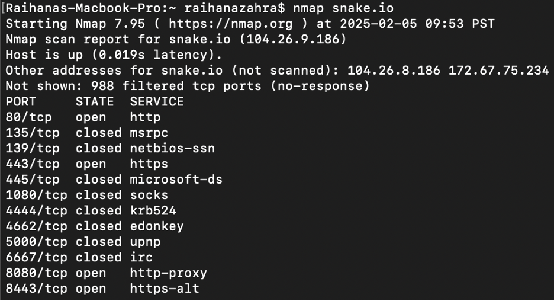
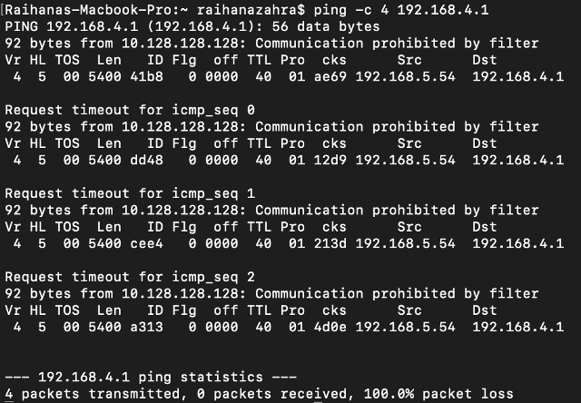

# Navigating the Internet Seas 🗺️
## Morgan's Log 📜

### 7 Feb 2025
Seems that I overslept last night...I do not know where I am! The waves of the Internet Seas must have knocked me out and set me off track from the route I was heading. No worries. I shall fear not as I am Captain Morgan, fearless explorer of this digital landscape.

It is truly incredible here. Messages travel at breakneck speeds, unseen but ever-present, like the wind guiding a ship’s sail. I do not yet have a map to guide me, but that shall be my task. I will explore these mysterious lands, chart their paths, and document my findings for future sailors of the digital world. This vast, interconnected Internet sea shall soon be revealed, and I, Captain Morgan, shall be its first great navigator. 

#### Ship Preparation ⚓️
As I venture into uncharted territory, I need take note of my surroundings. This area shall be home base, as I am unfamiliar with nothing else. I shall name this LMU. Let me search my Internet Protocol, Subnet Mask, Router, and Domain Name Server.

- IP Address: 10.27.238.138
- Subnet Mask: 255.255.0.0
- Router: 10.27.0.4
- Domain Name Servers: 10.0.100.16, 10.0.100.17

Perfect! Now let me review the routing table to see where I can get to from here.

Wow...I sure am lucky to be an explorer. There is so much to this world to see. However, it's getting late. I have a whole day ahead of me tomorrow with full energy, so I suppose I can wait. 

### 8 Feb 2025
What a beautiful day to set sail and venture yonder. With the ship secured, I shall scan the surrounding perimeter to seek other vessels. Fortunately, some are friendly and others... are okay. 

I am curious as to whether any of these ships would answer me call, I sent forth me trusty parrot, Squawkzilla, for contact. One was friendly enough to answer back.

Arghh matey! If Squakzilla was able to contact vessel 10.27.214.201, there is a chance I may find a route to get me to them!

Darn. Seems like the route is too foggy, I cannot make clear of anything. The seas are treacherous, but I will not be deterred! I shall try again to ping and traceroute with the router and DNS instead.

_**Router**_

_**Domain Name Servers (DNS)**_

Shiver me timbers! I see results! This means I might be able to get a better sense of where I am at if I can gather enough information of the two areas on the map that I know of. I shall contact LMU home base and snake.io, to see my favorite snakes. I shall do it, yet again.

_**LMU**_

_**Snake.io**_

With the waters unclear and the foggy air, I shall use my ancient tool -- my enchanted spyglass called the dig. Perhaps it will reveal the true coordinates of these lands!

_**LMU**_

_**Snake.io**_

Aha! The charts reveal that LMU hides behind many veils: 52.37.49.200, 54.189.142.187, 54.186.242.189, 50.112.186.15, and more! The fortress may have many gates, but at last, I know where they stand. Though they keep their walls high, knowledge be power! The snake as well, it lurks across 104.26.8.186, 172.67.75.234, and 104.26.9.186. This will be an interesting adventure. 

Let me see where the ports open at both of these sites. I may be able to find civilization after doing so.

_**LMU**_

_**Snake.io**_

Hmmm. I notice that both sites go through Port 80/tcp and 443/tcp with LMU having 994 filtered tcp ports and Snake.io having 988 filtered tcp ports. 

With me maps in hand, I realize that the journey to these distant lands is not so straightforward. There be intermediary stops along the way, stepping stones guiding me toward me destination. I shall uncover what ports may be open on these stops! This will lead me to where to go next in my voyage...

_**LMU**_

_**Snake.io**_

Ahoy! These hidden pathways show me the routes I must take, with some ports standing open for travel, while others remain closed or concealed. The Internet seas be vast, but I be learning its secrets one route at a time! I shall continue on my way. Now onto the Peets network to sip on my favorite coffee beans and perhaps the Concourse to maybe have a good nights sleep. Onwards...

### 10 Feb 2025

Its been a steady 2 days on the ship to from LMU harbors to now Peet's coffee. This public dock is just teeming with signal clashes, unknown vessels, and unpredictable tides. Now to do it all again... 

- IP Address: 192.168.5.54
- Subnet Mask: 255.255.254.0
- Router: 192.168.4.1 
- Domain Name Servers: 192.168.4.1

Blimey! Everything is different! This must mean I am at a different place in the Internet. Let me observe the routing table like last time and figure out other vessels around me.

To make contact, I sent forth Squawkzilla once again. I shall repeat the process of contacting, tracing the route, and mapping to the hosts.

_**Host**_

_**Router**_

_**DNS**_

Hmmm. I can trace all the routes for each of these places, which are the same. It all starts at 10.128.128.128. Let me now try to contact LMU and snake.io to see if there is a common denominator with this area. 

_**LMU**_

_**Snake.io**_

Ayeee! There is so much to see that I can even successfully ping and traceroute both of my sites! Tracerouting to both LMU and snake.io has its first stops at 47.176.203.133, 172.102.112.233, and 47.177.155.164 -- what a popular visit. And both have open Ports 80/tcp and 433/tcp, just like at LMU Harbor! Interesting. I shall try to dig for particular coordinates, maybe that will show me something. 

_**LMU**_

_**Snake.io**_

Goodness me! LMU has so many gates once again including 54.190.108.222, 54.189.251.234, 35.166.103.152, 54.187.60.41, and more! My trusty snake.io is small but mighty with only 3! Just 172.67.75.234, 104.26.9.186, and 104.26.8.186. Excellent. Now to just examine the intermediate stops between right now and these destinations...

_**LMU**_

_**Snake.io**_

Alas, it was too good to be true. Perhaps I cannot seek these hidden pathways but there is always another network to discover! While Peets is hiding me from my favorite sites to see, I shall not give up hope just yet! Onward to the private network now...the Concourse. 

### 15 Feb 2025

Oh mightey. What a long trip that was. Almost missed my next destination because of how private it is compared to the public network! Fun fact, the Concourse is supposedly Squakzilla's birthplace, so she's happy to be back home. Alrighty now, time to repeat the process.

- IP address: 192.168.245.102
- Subnet mask: 255.255.255.192
- Router: 192.168.245.65
- Domain Name Servers (DNS): 68.170.70.150, 98.159.94.150

Ah, just as I expected. Everything is different! We are very much at a different part of the internet world right now, and this routing table is a lot larger than the other two areas. Let's see who's around... maybe Squakzilla might have a nearby friend around here. 

Ah, perhaps I spy one possible vessel friend. Onward, Squakzilla! 

Nonsense. They did not respond back. Must they be too far or perhaps the pirates there are asleep? Maybe I shall try to navigate to them nontheless. 

Hmmmm. An interesting route. Seems that there's some sort of obstacle in the way, such as a firewall, that prevents me from a quick and direct route but I am still able to reach them. I'll try to do the same with the router and DNS instead... hopefully I can get better results then. I want to know more about what is around me vessel. 

 _**Router**_

_**Domain Name Servers (DNS)**_

Goodness me! What an interesting response. Alas, seems that I can successfully and quickly communicate with the router but I cannot find a route to them. At least they're somewhat reachable if I am ever in danger, just seems that they are in a bad area that I cannot go to them myself. Yet, I can both reach and find a route for the DNS! Well, at least parts of the route to DNS... I suppose they do not want to be found either. But, better than nothing! Now again to contact LMU and snake.io. 

_**LMU**_

_**Snake.io**_

My snakes have done it again! Of course they will let me reach them, nothing can stop me from getting to my snakes. Both at a quick and efficient speed with success. No hard feelings towards LMU home base but... I cannot ping nor find a complete route to them! I reckon this area may be unsafe for my own home base to not respond. Maybe I shall try to find their true coordinates with my tools since I cannot seem to get any responses otherwise. 

_**LMU**_

_**Snake.io**_

Ah. At least I can sense them from here somehow. Let me see what ports are open that I can perhaps stop at.

_**LMU**_

_**Snake.io**_

Interesting! Both have open ports at PORT 80/tcp and 443/tcp but Snake.io also has open ports at PORT 8080/tcp and 8443/tcp. Let me see what the intermediary stops are in between each if there are any obstacles. 

_**LMU**_

_**Snake.io**_

